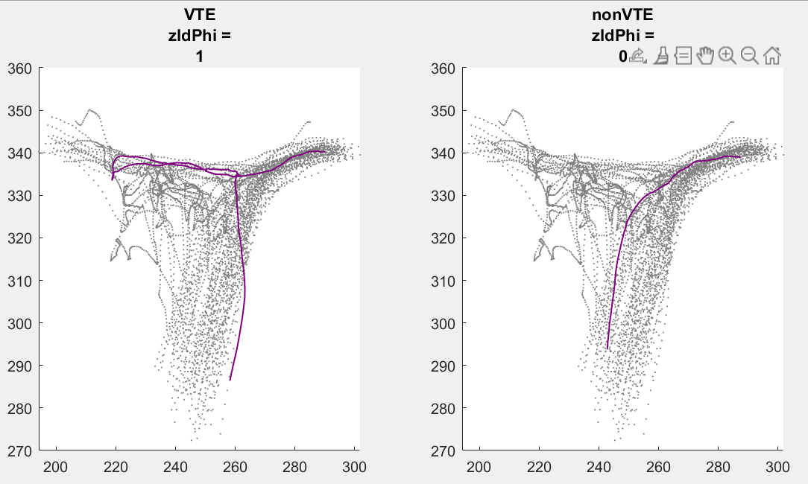

# zIdPhi: Algorithm for Vicarious Trial and Error (VTE) quantification
The zIdPhi algorithm, as described in Papale et. al.(2012). This implementation utilizes the edited source code obtained from Dr Andrew Papale Github.

#### (Matlab implementation)

## Getting started
1. Fork or clone the repository to your desired Matlab folder
2. Follow the comments in zIdPhi file and adjust the code, so it fits  your data structure.

## References
1. https://github.com/andrewpapale/odorTrails
2. Papale, A. E., Stott, J. J., Powell, N. J., Regier, P. S., & Redish, A. D. 
(2012). Interactions between deliberation and delay-discounting in rats. 
Cognitive, Affective, & Behavioral Neuroscience, 12(3), 513-526.
3. Janabi-Sharifi, F., Hayward, V., & Chen, C. S. J. (2000). Discrete-time
adaptive windowing for velocity estimation. IEEE Transactions
on Control Systems Technology, 8, 1003–1009.